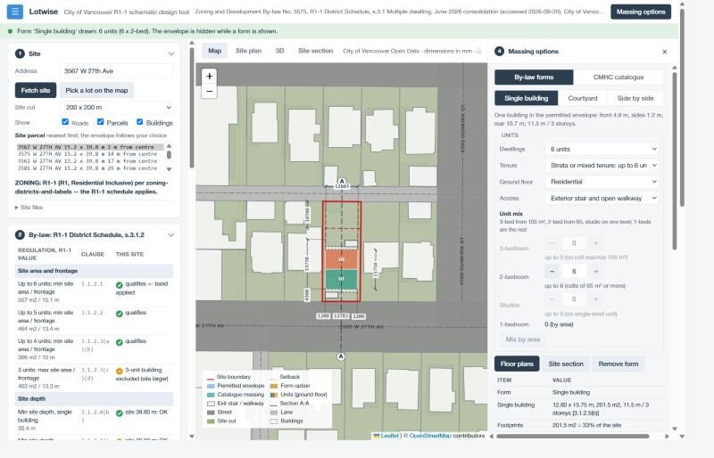
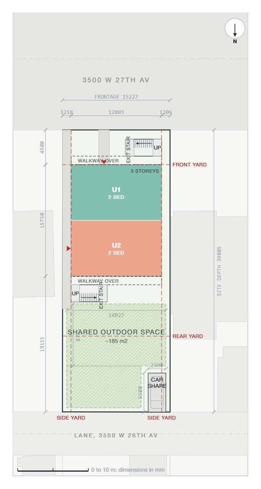
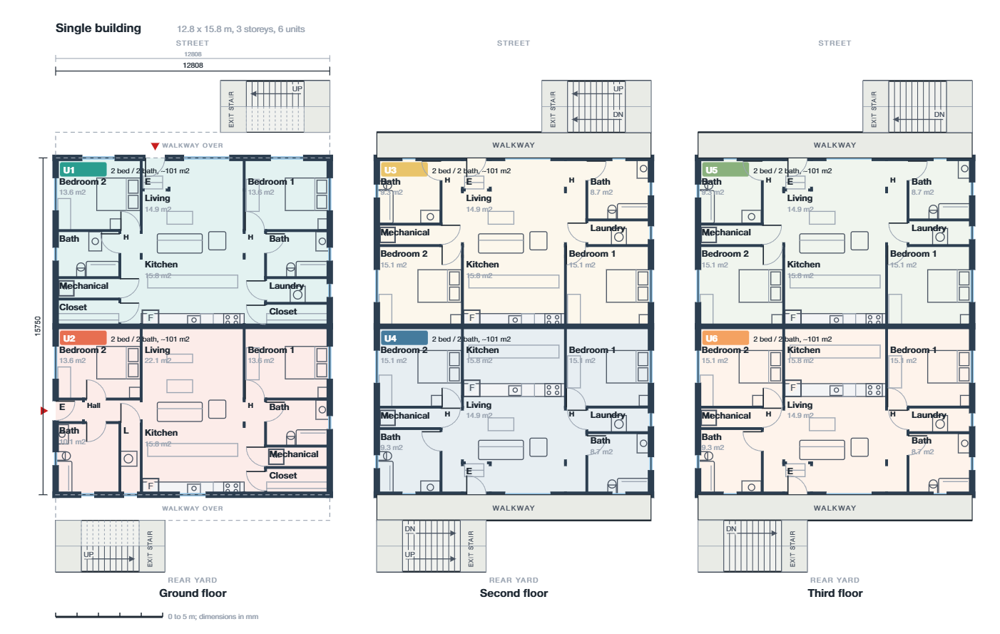
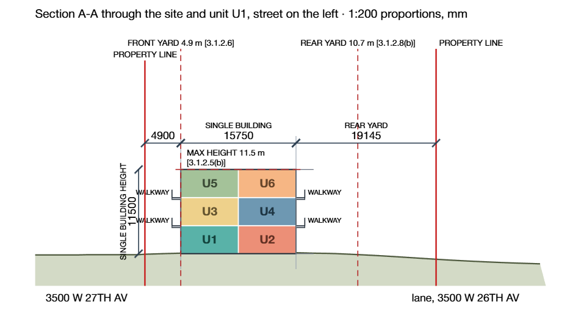

# Lotwise

*City of Vancouver R1-1 schematic design tool.*
**Live tool (GitHub Pages): https://kailisun98.github.io/r1-1-massing/** · Repository: https://github.com/kailisun98/r1-1-massing

## 1. Purpose

Lotwise is a tool that helps architects and designers study schematic designs in minutes. Users
pick any R1-1 site within the City of Vancouver and the tool imports the surrounding topography and
context within a radius selected by the user. The tool then confirms the street edge automatically,
and users can generate their own test fit based on the permissible build area on the site.
Alternatively, they can select from the CMHC Housing Design Catalogue's inventory of recommended
unit typologies and the tool fits them to size automatically. Lotwise also creates a working site
plan as well as unit test fits, with areas and FSR accounted for, for preliminary massing
generation. Future versions will include the option to export the massing to Revit along with the
created site.

## 2. How to use it

Lotwise is a web page (HTML, CSS and JavaScript; no server, no account), published with GitHub
Pages at the link above. It talks to the City of Vancouver Open Data portal directly from the
browser.

1. Open https://kailisun98.github.io/r1-1-massing/ in a desktop browser (Chrome, Edge, Firefox or
   Safari). The example lot, 3567 W 27th Ave, loads by itself: the site is fetched, the street edge
   detected and the permitted envelope drawn, so the page opens in a working state. Click
   **Walkthrough** in the top bar for a guided two-minute demo: it steps through everything below
   on the live page, with a spotlight and a short note at each stop (Next, Back, Skip; arrow keys
   and Esc).
2. In **Site** (step 1) type another Vancouver address and press Enter or **Fetch site**, or click
   **Pick a lot on the map** and click inside any lot. The site cut (200 × 200 m by default) sets
   how much context is imported. The by-law table (step 2) says whether the lot is zoned R1-1 and
   which rules it meets; if the street edge is not detected, choose it in the list that appears or
   pick a point on the map.
3. Read the **by-law table** (step 2) and the **permitted envelope** (step 3). Every row cites its
   clause: a green check is a rule applied and met, a red cross a rule not met, an amber dash a
   rule that does not apply to what is drawn.
4. Open **Massing options** (step 4, the panel on the right). Under **By-law forms** pick a form
   (single building, courtyard, side by side) and set the dwellings, tenure, ground-floor use,
   access (exterior stair and walkway, or a shared internal stair) and the unit mix; under
   **CMHC catalogue** click a design that fits the envelope. The unit table and stack diagram
   appear below.
5. Switch the stage with the tabs **Map**, **Site plan**, **3D**, **Site section**,
   **Floor plans** and **Summary** (keyboard: Alt+1 to Alt+6). The floor plans sheet carries the
   plan check under the drawing; the site plan has car-share and outdoor-space options above it.
6. End with **Summary** (the last tab, or the Summary button under the massing options): the key
   development statistics of the drawn option (site, envelope, coverage, gross floor area and FSR
   against the 1.0 cap, units and family units, tenure, access, car share, outdoor space), the
   by-law checks, the unit schedule, the 3D view, the site plan, the section and the floor plans
   on one page. **Export PDF** (on the sheet, and in the title bar once an option is drawn)
   writes them to a four-page A4 report.
7. **Copy report** (left bar, Report) copies the whole run with every clause; **Save site file**
   keeps the fetched data for the shared copy of the app.

To run it on your own machine: clone the repository and serve the folder, for example

```bash
python -m http.server 8765
```

then open http://localhost:8765/. Opening `index.html` straight from disk also works in most
browsers. `selftest.html` runs the engine checks (80) and `ui-test.html` the component checks (96);
`ui-gallery.html` shows the interface components.

This repository also holds the Revit 2026 (pyRevit) version of the same workflow, **R1-1
Massing**: see [Install](#install) and [The panel](#the-panel) for how to install and run it.

## 3. Source

City of Vancouver, Zoning and Development By-law No. 3575, **R1-1 District Schedule**, June 2026
consolidation. https://bylaws.vancouver.ca/zoning/zoning-by-law-district-schedule-r1-1.pdf —
accessed 2026-09-20. Cited passages: `../source/r1-1_extract.md`.

| What | Value | Clause |
|---|---|---|
| Min site area / frontage, 6+ units | 557 m² / 15.1 m | 3.1.2.1 |
| Min site area / frontage, 5 units | 464 m² / 13.4 m | 3.1.2.2 |
| Min site area / frontage, 3–4 units | 306 m² / 10.0 m | 3.1.2.3(a)(b) |
| Max site area / frontage for 3 units | 463 m² / 13.3 m | 3.1.2.3(c)(d) |
| Min site depth, single building | 30.4 m | 3.1.2.4(b) |
| Max height, single building | 11.5 m, 3 storeys | 3.1.2.5(b) |
| Front yard | 4.9 m | 3.1.2.6 |
| Side yard | 1.2 m | 3.1.2.7 |
| Rear yard, single building | 10.7 m | 3.1.2.8(b) |
| Max building depth | 19.8 m | 3.1.2.9, measured per 4.2.3 |
| Max building width | 17.4 m | 3.1.2.10 |
| Unit cap by tenure (8 rental / 6 otherwise) | — | 3.1.1.3 |
| Multiplex site preconditions (lot on record, lane access, not in flood plain) | — | 2.2.7 |
| *More than one building (form options, section 5):* | | |
| Min site depth, courtyard configuration | 33.5 m | 3.1.2.4(a) |
| Max height, rear buildings | 8.5 m, 2 storeys | 3.1.2.5(a) |
| Rear yard, courtyard configuration | 0.9 m | 3.1.2.8(a) |
| Separation, buildings on the site frontage / rear buildings | 2.4 m | 3.1.2.11(a), (b) |
| Separation, frontage building to rear building | 6.1 m | 3.1.2.11(c) |
| More than one principal building | Director of Planning may permit | 2.2.9 |

These are by-law regulations, not guidelines. The tool applies the minimums as written; wherever
the schedule says "the Director of Planning may" (2.2.9, 3.1.2.12, 3.2.2.9, 3.2.2.11) the decision
is left to a person and named in the output. The same table, with a fourth column saying what
applies to the current site, is section 3 of the panel. The single-building values are `RULES` in
`lib/r1_1_core.py` (shared verbatim with the Rhino script); the multiple-building values are
`FORM_RULES` in `lib/r1_1_massing.py`, transcribed from the 3.1.2 table in `../source/r1-1_extract.md`.

Site data: City of Vancouver Open Data (Open Government Licence – Vancouver), datasets
`property-addresses`, `property-parcel-polygons`, `zoning-districts-and-labels`,
`building-footprints-2015`, `building-footprints-2009` (LiDAR heights and ground),
`elevation-contour-lines-1-metre-contours`, `public-streets` and `lanes` (centrelines); NRCan
CDEM as a point-elevation fallback. Everything
imported is **approximate context**; parcel dimensions must be checked against a legal survey
before they are relied on.

## 4. Example

**Input:** the address *3567 W 27th Ave* (an R1-1 lot in Dunbar-Southlands, 15.2 × 39.8 m, the
example that loads with the page), the 200 m site cut, then the **Single building** form with the
default 6 strata units.

**Result:** the site is fetched from the City's open data and the street edge found on W 27th Ave.
The by-law table reads: the site qualifies for up to 6 units [3.1.2.1]; front yard 4.9 m, side yards
1.2 m and rear yard 10.7 m applied [3.1.2.6 to 3.1.2.8]; the maximum building depth of 19.8 m
controls the envelope [3.1.2.9]; envelope 12.78 × 19.80 m, 11.5 m high [3.1.2.5(b)]. The form is
drawn as six stacked two-bedroom flats, two per floor, trimmed to FSR 1.00, and every tab follows.









The report of the same run (copied with **Copy report**) reads, in part:

```
YARDS APPLIED (single principal building):
  Front  4900 mm (4.9 m)   [3.1.2.6]
  Side   1200 mm (1.2 m)   flat; s.3.2.2.11 reduction does not apply to multiple dwelling  [3.1.2.7]
  Rear   10700 mm (10.7 m)   [3.1.2.8(b) (all other buildings)]

ENVELOPE:
  Depth  19800 mm (19.80 m)   controlled by: max building depth  [3.1.2.9; measured per 4.2.3 ...]
  Width  12777 mm (12.78 m)   within max width  [3.1.2.10]
  Height 11500 mm (11.5 m) / 3 storeys   [3.1.2.5(b) (all other buildings: 11.5 m and 3 storeys)]

FORM OPTION: Single building
  Single building: 12.81 x 19.80 m, 253.4 m2, 11.5 m / 3 storeys [3.1.2.5(b)]
  Floor area if every storey is full: 760 m2 = FSR 1.26; cap 1.00 [3.1.1.2]; ...
```

## 5. Skill and limits

There is no separate skill file; the reusable knowledge is in the code and the source extract:
[`web/core.js`](web/core.js) (`RULES`: every schedule value with its clause, the evaluation and the
report), [`web/units.js`](web/units.js) (unit counts by tenure, the family-unit minimum, the mix
limits), [`web/rooms.js`](web/rooms.js) (room sizes, clearances and the adjacency rules distilled
from dimensions.com and the CMHC catalogue plans), [`web/plans.js`](web/plans.js) (the plan check)
and `../source/r1-1_extract.md` (the cited passages of the schedule). The Revit version shares the
same values in `lib/r1_1_core.py`.

What Lotwise does not do, and where a person must check the result:

- It is a schematic design aid, not a permit or code review. Nothing it draws is a submission.
- The by-law is applied as numeric rules from the June 2026 schedule. Conditional and discretionary
  provisions (Director of Planning approvals, design guidelines, heritage, trees, parking,
  servicing, flood plain and lane-access preconditions) are listed as assumptions or not checked;
  the table marks them.
- FSR counts the gross area of every storey; the schedule's exclusions (for example 7.5 m² per
  stacked unit, 4.1.2(l)) are not modelled, so a scheme shown at FSR 1.00 may have room to spare.
- The ground comes from the City's 1 m contours and building heights, interpolated; street-edge
  detection is automatic and must be overridden when it is wrong (a corner lot, an odd parcel).
- The floor plans are test fits: rooms are sized to standard furniture and clearances and checked
  for circulation, but structure, services, egress distances, window areas, accessibility and
  energy are not. Stairs are sized on a 3.1 m storey; the real floor-to-floor is a design decision.
- The single exit stair arrangements assume the BC Building Code 2024 and Vancouver Building
  By-law single-exit provisions apply; confirm with a code consultant.
- Catalogue designs are fitted by their published footprints and unit lists; CMHC's own drawings
  govern, and the designs are illustrative, not for permit.
- The shared claude.ai copy works only on its six stored lots or a saved site file; the live site
  needs the City's open-data portal to be reachable from the browser.

The sections below document the web app and the Revit tool in detail.

## Web app: Lotwise

**Lotwise** (the name: it reads a lot and advises on it) is the same workflow in a browser, with no
server and no Revit: [`web/index.html`](web/index.html). Its subtitle is *City of Vancouver R1-1
schematic design tool*.
**Live site:** https://kailisun98.github.io/r1-1-massing/ (GitHub Pages, from the public repo
https://github.com/kailisun98/r1-1-massing, which holds only the web files, a README and
`.nojekyll`; to update it, copy the changed files from `web/` into that repo and push).
The home page is the plan on a map (OpenStreetMap tiles under the tool's own drawing, shown
desaturated and lightened in the manner of the "subtle grayscale" map style so the drawing reads
first) with collapsible steps in a sidebar (click a heading to fold it): **Site** (type an address
or pick a lot on the map; the fetch imports the nearest parcel, detects the street edge and draws
the envelope by itself; changing the parcel or the cut re-runs it; a street-edge chooser appears
only when detection fails), the **by-law table**, the **permitted envelope** results, and **Massing
options** with a toggle between the by-law forms and the CMHC catalogue; the stage has five tabs,
**Map**, **Site plan**, **3D**, **Site section** and **Floor plans**. It talks to the City of Vancouver Open Data portal directly from the browser (the portal
allows it), so it can be hosted as static files anywhere (GitHub Pages, a course server) or served
locally:

```bash
python -m http.server 8765 --directory web
```

then open http://localhost:8765. Opening `index.html` straight from disk also works in most
browsers. On load it runs the example site (3567 W 27th Ave) through to the envelope so the page
opens in a working state; type another address to start over.

- `web/core.js`, `web/site.js`, `web/massing.js` are line-for-line ports of `lib/r1_1_core.py`,
  `lib/r1_1_site.py` and `lib/r1_1_massing.py` (the same RULES and FORM_RULES values, clipping,
  detection, dimension strings, form options, section plan and tables); `web/app.js` is the page.
- Map drawing mirrors the Revit plan: the site square as a green plate, streets and lanes filled
  to the parcels, parcels and buildings clipped to the square, the red site boundary, dashed
  setbacks, the blue envelope, amber forms, the dimension strings outside the lot (values in mm),
  the A-A section marker. The existing house is hidden after Generate (checkbox), and the envelope
  is hidden while a courtyard or side-by-side form is shown. Click *Pick a point on the map* then
  the map to choose the street edge by hand.
- *Pick a site on the map* (step 1): drag the map anywhere in the city and click inside a lot; the
  parcel dataset returns the lot's civic address and the fetch runs centred on it. In the shared
  copy the red pins are the stored sites; clicking a pin or near it loads that site.
- **3D** builds a terrain heightfield from the fetched elevation points (a site block with a flat
  base) with the plan painted on it as a texture (ground, streets and lanes, parcel lines, the red
  site boundary, 2048 px over the cut) so nothing fights the surface on a slope; the buildings, the
  envelope or the form sit on it; orbit with the mouse. The camera is set once per site and kept
  while forms or catalogue options are swapped. The ground is a Gaussian-weighted plane fit through the elevation points around each
  sample (`R1Massing.groundAt`, neighbourhood 16/40/80 m until the points spread in two directions),
  which follows the slope between the 1 m contours instead of stepping from one to the next; the
  Revit tool still uses the nearest-five average, so its envelope base can differ by a few
  centimetres. Building tops stay at the LiDAR height; bases are sunk below the lowest ground under
  the footprint.
- **Step 4, by-law forms with units** (`web/units.js`): toggling Single building, Courtyard or Side
  by side now also lays units into the form, in the spirit of the catalogue designs (stacked flats,
  flats under two-level units, townhouses, two by two, and a wider ground flat for the counts in
  between). The *Dwellings* list holds every count the buildings can take; *Tenure* switches
  between strata or mixed tenure (up to 6, 3.1.1.3(b)) and 100% residential rental (up to 8,
  3.1.1.3(a), on a site in the 6-unit band); the 2.2.8 minimum of two-bedroom units is checked and
  met by upgrading the largest one-bedrooms. *Ground floor* can give one ground cell to a shared
  amenity room (floor area, FSR 1.00), a neighbourhood grocery store (the only non-dwelling use of a
  mixed-use residential building, 2.2.5, conditional) or a child day care (conditional, up to 10%
  of floor area excluded, 4.1.2(m)). Because a full three-storey envelope exceeds FSR 1.00 on a
  standard lot, the configurator trims the front-row buildings from the rear to the FSR-limited
  depth and redraws the massing at that depth (the note says by how much). *Access* chooses how
  the upper units are reached: an exterior stair and open walkway, or a shared single exit stair
  in an internal core (a 2.4 m band across the depth with a street vestibule, a straight stair,
  a corridor on every floor and a bike room; the units either side open onto the corridor, the
  street-facing ground units keep their own front doors; offered where the layout has at most two
  units across and the building is deep enough for the stair, otherwise that building keeps the
  exterior stair with a note). *Unit mix*: by area (3-bed from 105 m², 2-bed from 65, 1-bed from
  38, a studio below that), each unit held to the bedrooms its rooms can actually hold, or set by
  hand with the 3-bedroom, 2-bedroom and studio selects (1-beds are the rest): each select is
  capped by how many units can hold that type, found by laying every unit out as a 3-bed, then a
  2-bed, and counting the bedrooms that fit a bed with its clearances, with the area floors above;
  studios are single-level units. The 2.2.8 family-unit minimum is still checked and shown when a
  hand-set mix falls short. Units are coloured on the map, in 3D and in the unit table, and *Floor
  plans* opens the sheet for them too.
- **Standard test fits** (`web/fits.js`): the room sizes, furniture and clearances the plans are
  built from, transcribed from dimensions.com's Layouts pages (read 2026-09-29; the element slug is
  kept with each value): one-wall bathrooms (half 1.42–2.13 × 1.37–1.68 m, three-quarter
  2.13–2.9 × 1.52–1.83 m, full 2.13–2.74 × 1.52–1.83 m) with 0.61 m activity and 0.76 m circulation
  clearances; queen 1.52 × 2.03 m, double 1.37 × 1.91 m and twin 0.97 × 1.91 m beds with 0.76 m
  clear on their open sides and rooms from 9.8, 9 and 7.75 m²; living fits of 3.35 × 2.74 m (sofa
  and armchair) and 3.66 × 2.74 m (sofa facing two armchairs); a casual dining table 0.76–1.07 ×
  1.22–1.52 m with 0.91 m behind the chairs (0.46 sitting + 0.46 circulation); a single-row kitchen
  with a 1.2 m aisle and a 2.1–3.8 m run (an L-shape needs a 1.07 m aisle). Fixture and furniture
  sizes not on those pages are the usual catalogue sizes (0.6 m counter, 0.76 × 1.52 m tub, 0.9 m
  shower, 2.1 × 0.9 m sofa, stacked washer and dryer); stairs follow BC Building Code 2024 Part 9
  (width 0.86 m, rise under 0.2 m, 0.26 m run).
- **Room layouts** (`web/rooms.js`): every unit level is composed from those modules, following
  the adjacencies of the CMHC catalogue plans (Fourplex 01 and 02, Rowhouse, Duplex, Courtyard
  Sixplex, ADU 02, read from the summary packages on 2026-10-01) and ordinary townhouse and
  apartment practice: the entry opens into a vestibule with a coat closet and from there into the
  living space; living, dining and kitchen are one open room (the kitchen has no door and stands
  against the back or a side wall, open along its whole front); bedrooms and bathrooms open off a
  hall (a short hall off the living room, a cross hall, or the upper landing), never off the kitchen
  or another bedroom; a powder room may open off the entry hall or the dining area; the primary
  bedroom gets the ensuite and a walk-in closet; laundry and mechanical are closets off a hall;
  spare depth goes to the rooms (a study, an office), never to a store; a bedroom turns its back on
  an open walkway when its wing has windows on the far side. Stairs are sized on a 3.1 m storey (the
  by-law height is a maximum, not a storey height): a U-stair core 2.0 × 3.0 m in the same place on
  every level, a 1.0 × 4.9 m straight run along the party wall of a narrow unit, or, in a shallow
  unit, the U-stair across the back wall in a 2 m band with the powder room (upstairs the bath and
  laundry) beside it. A flat 9.6 m or wider has the living space in the middle bay between bedroom
  wings at the ends (the bedroom on the window wall, a hall along the living room, the bath and
  closets beside the hall; reached by the side path, the wing on that side carries the vestibule
  and a cross hall); a flat 8 m or deeper has a hall along the blind party wall with living in
  front, the wet band and the bedrooms behind; a smaller flat has a living column beside a private
  column; a studio one room. A two-level unit entered at grade has living, dining and kitchen below
  (entry, stair, powder room, laundry and mechanical closets in the column) and bedrooms above (the
  primary suite in front, the bath row, the other bedrooms off the hall or a cross hall); one
  entered above grade from the exterior stair has its bedrooms on the entry level and its living
  level on top, as the catalogue draws Fourplex 01 and the Sixplex; a three-level unit adds a last
  bedroom with a den and a terrace in the roof. Wide upper levels get a hall along the stair with
  cross halls and rows of rooms (bath, bedrooms, study, office). No closet is bigger than 4.5 m²
  (a walk-in 6.5) and no bedroom over 22 m². `R1Plans.check` re-reads every drawn plan and reports
  what it still fails: a room without a door, a door under 0.86 m, a bedroom no bed fits, a living
  room under 3.2 m, a dining room under 2.6 m, a kitchen under 1.7 m or with a run under 2.1 m, a
  bath under 1.5 m, a stair that does not stack, a unit with no way in, and the circulation: a
  bathroom or bedroom opening off the wrong room, a closed kitchen, a closet grown into a room, an
  oversized bedroom, the wrong number of bedrooms, a room that cannot be reached from the entry (or
  the stair above) without passing through another room, a stair that opens off no hall; the sheet
  and the unit panel show the result. Every by-law form at every unit count and tenure, the core
  option and every fitting catalogue design pass with no items.
- **Access** (`web/access.js`): how every unit is reached. Ground units are entered at grade from
  the street, or from the side-yard path when a cell sits behind another. With the internal-core
  option every unit not on the street opens onto the core's corridor and the core itself is
  entered from the street (and leaves to the rear yard). Otherwise a unit whose entry level
  is an upper floor is reached by an exterior single exit stair and a 1.2 m open walkway on one
  face: the rear (lane or courtyard) face of a building on the street, the courtyard face of a rear
  building, or the front face for an upper unit that touches only the front. One stair per face
  serves every floor with a walkway on it; it is a switchback of two 1.2 m flights along the face
  (0.27 m goings, risers under 0.18 m, a floor landing at the walkway end and a mid landing at the
  far end, 5.1 m long for 3.83 m floors), at the side-1 end of a rear walkway and the side-2 end of
  a front walkway so the stairs of a front and a rear building never meet across the courtyard. A
  unit entered from the rear (or the right) is flipped so its entry sits on that face. The plans
  draw the walkway and the stair on every floor (dashed where they pass overhead, UP/DN on the
  flights), the map and the site plan their footprints, 3D the slabs, guards and stair, the section
  the slab and the stair it crosses; the report and the notes say which units each stair serves.
  The by-law's yard-projection rules for open stairs are not checked; a single exit stair is
  permitted for buildings of this size under the BC Building Code 2024 and the Vancouver Building
  By-law (to be confirmed with the code consultant).
- **Floor plans tab** (`web/plans.js`, `drawPlans` in `app.js`): a sheet in the main stage with a
  floor filter (All / Ground / Second / Third), three scales, a *Site section* switch that draws
  the section A-A beside the plan options so plans and section read together, a 5 m scale bar, a
  legend, the plan check and the notes of the drawn option (the massing panel also has a *Site
  section* button next to *Floor plans*). The plans are drawn as plans: 300 mm exterior walls,
  250 mm party walls between units, 120 mm partitions, drawn as segments with every opening left
  out of them (a door or a cased opening is a real gap, nothing is painted over); an entry door per
  unit on the face it is reached from (street, walkway or side path), interior doors with swings
  from the circulation rooms into the served rooms (a walk-in closet off its bedroom, a laundry or
  pantry off the kitchen) and cased openings between entry, living, dining, hall and kitchen;
  windows on the exterior walls of habitable rooms. Furniture is drawn at catalogue size from the
  fits: the largest bed the room holds with its clearances (queen, double or twin) with nightstands
  and closet; toilet, vanity and tub or shower on one wall; a single-row kitchen with fridge,
  sink, dishwasher and range (a second row across a 1.2 m aisle when deep enough); a table for 4 or
  6 with its chairs; sofa, coffee table, armchair and TV unit; a U-stair with both flights, its
  landing and the UP/DN arrow, or a straight run; a stacked washer and dryer. Room names with
  areas sit in each room's top-left corner clear of the fittings (no halos); overall and unit
  dimensions in mm. The sheet reads as a rotation of the map with the street at the top, the same
  frame as the site plan, so a lot whose side 1 lies on the right of that view is drawn mirrored.
  `R1Cmhc.floorPlansSvg` keeps the earlier block diagram for tests.
- **Site plan tab** (`web/siteplan.js`, `drawSitePlan` in `app.js`): the lot with its street and
  lane, the neighbours' parcels and buildings in halftone, the yard lines of the schedule labelled
  (front 4.9 m, sides 1.2 m, rear 10.7 m, and 0.9 m behind a rear building), the footprints with the
  ground-floor units in their colours, the entries, the exit stairs and walkways, a 1.5 m walk from
  the street to the front entries and a 1.2 m path along the side yard to the rear, one or two
  car-share stalls (2.5 x 5.5 m) at the rear lot line entered from the lane, and the shared outdoor
  space that the rear yard (or the courtyard) leaves after them, hatched, with its area and its
  area per dwelling; the *Shared + patios* configuration gives the ground units on the yard 3 m
  private patios and moves the shared space behind them. Every dimension is in halftone (lot,
  yards, buildings, outdoor space, stall), with a north arrow (the sheet is a rotation of the map,
  street at the top) and a 10 m scale bar; a schedule beside the drawing lists site, footprint and
  coverage, outdoor space, stalls, access, paths and units. Labels keep out of the drawing: the
  yard lines are tagged in the margins (front and rear at the right end of their lines, side yards
  at the lane end), the dimension chains sit in one band on each side, and the unit tags, storey
  count and stair names are the only text inside the lot. The parking assumption (no minimum for
  an R1-1 multiplex, stalls optional) and the untested schedule rules (site coverage, impermeable
  area, outdoor space) are stated in the notes; a courtyard form gets no stall because its rear
  building stands 0.9 m off the lane.
- **3D annotation**: each unit box has its programme painted on its faces in large letters in a
  darker shade of its colour (U3 · 3 BED, GROCERY STORE), the way a programme diagram is drawn;
  the by-law blocks and the bare envelope are labelled the same way.
- **Summary tab and PDF** (`web/summary.js`, `drawSummary` and `exportSummaryPdf` in `app.js`):
  the last tab of the flow. `R1Summary.stats` gathers the statistics of the drawn option from the
  envelope, the form and the unit configuration: site area, frontage, depth and unit band; the
  permitted envelope, its controlling constraint and the yards; each building's size, height and
  storeys with its clause, the separations, site coverage, gross floor area (every storey full,
  or the catalogue's gross building area) and the FSR against the 1.0 cap of 3.1.1.2; the
  dwellings and their mix, the family units against the 2.2.8 minimum, tenure, ground-floor use,
  average unit area, access, the car-share stalls and the shared outdoor space of the site plan;
  then the option's checks and the plan check, and the unit schedule. The page shows them beside
  a capture of the 3D view, with the site plan, the section and all the floor plans below.
  **Export PDF** loads jsPDF 2.5.1 and its AutoTable plugin from cdnjs on first use and writes a
  four-page A4 landscape report (statistics and checks; the 3D view; site plan, section and
  unit schedule; floor plans), the SVG sheets rasterised through a canvas; the Pages copy saves
  the file directly and the artifact copy hands it to the viewer through the host's download
  prompt. **Print** (Pages copy) prints the summary alone through a print stylesheet.
- **UI**: following the usual principles (hierarchy, progressive disclosure, consistency, contrast,
  accessibility, proximity, alignment, feedback): one title bar; a status strip under it that is
  always visible, colour-coded, with a spinner while a fetch runs or the plans are being checked;
  both side bars collapse; one primary action per step; segmented controls for the massing source
  and the form; option cards with a fits / no-fit pill; disclosure sections for help text; keyboard
  shortcuts Alt+1 to Alt+6 for the views, Alt+M and Alt+S for the bars. The by-law table (step 2)
  marks every rule: a green check where it is applied and met, a red cross where it is checked and
  not met, an amber dash where it does not apply to what is drawn (the courtyard and side-by-side
  rules until such a form is drawn, the 3-unit rule on a larger site), with a key under the table;
  the marks carry an accessible label. The unit settings are grouped (count, tenure, ground floor,
  access; then the mix). The stage, the steps and the massing options have fixed grid positions, so
  hiding a bar widens the stage instead of shifting it.
- **UI components** (`web/ui.js`, styles and design tokens in `web/ui.css`; gallery
  `web/ui-gallery.html`, tests `web/ui-test.html`): the page is built from a small, dependency-free
  component layer, `R1UI`. Each factory takes a host element and a props object, renders into the
  host and returns `{ el, update(partialProps), destroy() }`; props go in, callbacks (`onChange`,
  `onToggle`, `onReselect`) come out, and `update()` never fires a callback: it syncs the DOM in
  place (focus and scroll kept) while the item ids are unchanged and rebuilds only when they change.
  Components: `tabs` (the five views; a tablist with roving tabindex and manual activation, so a heavy
  pane is not built while arrowing past its tab; panels get `role=tabpanel`), `segmented` (massing
  source, form; a radio group, arrows move and select, re-choosing fires `onReselect`), `toolbar`
  (the floor, scale, section, car-share and outdoor-space groups above the sheets), `status` (the
  strip: a polite live region, assertive for errors, `aria-busy` while working), `notice` (the plan
  check, with its items as a list; an error is an alert), `busy` (the placeholder while a sheet is
  computed), `optionList` (the catalogue designs: a listbox whose non-fitting cards stay focusable
  and readable with the failing rule; skeleton cards while loading; a sentence when empty), `table`
  (by-law, envelope, form and unit tables: scoped headers, group rows as row-group headers, state
  marks with text alternatives, element cells for the colour swatches, skeleton rows, an empty row),
  `stepper` (the unit mix: − and + with "Fewer/More …" names, a help line stating the limit and its
  reason, typed values clamped, max 0 disabling the control), `field` (a labelled select or input
  with help and an error wired through `aria-describedby` / `aria-invalid`), `collapsible` (each step
  folds from its heading, which becomes a disclosure button; the folds are remembered per browser)
  and `toggleButton` (the bars and the map pick modes, `aria-pressed`). Edge cases handled
  everywhere: zero or one item, a value not among the items (nothing selected, a `console.warn`),
  a disabled current value, long labels (ellipsis plus title), rapid repeated updates. Tab strips
  scroll sideways on a phone, toolbars and cards wrap, targets grow to 44 px on coarse pointers,
  motion stops under `prefers-reduced-motion`, and every colour is a token that `ui.css` redefines
  for dark mode. `ui-gallery.html` shows each component live with its props table, state knobs
  (loading, empty, disabled, error), a demo-width slider and a theme switch; `ui-test.html` drives
  every component through the DOM events a user would fire (86 checks, all passing).
- **Layout**: a top bar carries the name, *Lotwise*, with its subtitle *City of Vancouver R1-1 schematic design tool*, the
  source line, a button that hides or shows the steps on the left and one for the massing options
  on the right. The massing options (step 4) sit in the right panel, which opens as soon as the
  site has its envelope; in 3D every unit box carries its tag (unit, bedrooms) and each building a
  heading with its unit count. Plans and the site plan are laid out as on the site: street at the
  top, so a front building's street face is its top edge and a rear building's lane face its bottom
  edge, with STREET / COURTYARD / LANE captions.
- **Step 6, CMHC catalogue fit** (`web/cmhc.js`): the seven British Columbia designs of CMHC's
  Housing Design Catalogue (two accessory dwelling units, duplex, two fourplexes, rowhouse,
  courtyard sixplex), with the building summary of each design's summary package transcribed
  (units, storeys, footprint, width, depth, roof-peak and mid-slope heights, unit list) and the unit
  layout per floor read from the plan pages. *Check catalogue fits* tests each design alone, the
  rowhouse at every longer row that fits, the catalogue's own courtyard sixplex, each fitting
  principal design with an accessory unit as the rear building of a courtyard configuration
  (3.1.2.4(a), 3.1.2.8(a), 3.1.2.11(c), 3.1.2.5(a)) and side-by-side pairs (3.1.2.11(a)), against the
  envelope width and depth, storeys and height, the site's unit band and FSR 1.0, listing the
  failing rule for the rest. Clicking a fitting option draws it in teal as the massing (map, section,
  3D, same pipeline as the form options), with every unit in its own colour: the ground-floor units
  labelled on the map, one box per unit per floor in 3D, the stack diagram and the unit table
  (bedrooms, bathrooms, floors, approximate share of the footprint, adaptable versions). Units are
  split across the width, front to back or two by two as the catalogue plans show. *Floor plans*
  opens the Floor plans tab with schematic plans of every floor of every building: each unit's
  rooms from a programme fitted to its size and level (`R1Cmhc.programme`: a one-level flat has
  entry, living, kitchen, dining, bedrooms, bath, laundry; a two-level unit a living level with
  entry, stair, living, dining, kitchen and powder room under a bedroom level with primary bedroom
  and ensuite, further bedrooms, bath and laundry; a three-level townhouse adds an entry level with
  a den, the duplex an attic level with a terrace; a common room, store or day care has its own
  programme), entries marked on the street side. The catalogue's own room plans are linked from
  the sheet. Blocks are drawn
  to the roof peak; the catalogue roofs are pitched. The designs are CMHC's, illustrative and not
  for permit.
- Typography: Helvetica Neue with Helvetica and Arial fallbacks, system monospace for figures; no
  web-font download.
- **Site section** is the same cut as Revit's: street on the left, ground profile, buildings,
  the string of dimensions along the top (each named) and a height per building, recut on every
  change. With a unit option the line runs through the middle of the first ground-floor cell
  (never along a party wall) and the section shows one box per unit per floor in its colour with
  its programme (U4 · 2 BED, GROCERY STORE), the walkway slabs with their guards and the exit stair
  it crosses, the property lines, the yard lines of the schedule (front 4.9 m, rear 10.7 m, and
  0.9 m for a rear building) and the height limit over each building, all labelled with their
  clauses. The annotation keeps clear of the drawing: the building heights stand outside it (the
  front or only building's in the front yard on the left, a rear building's beyond the rear
  property line on the right), the yard and property lines run up into a head band where their
  names are laid out on rows so that no name sits across another line (a name is anchored left or
  right of its line when centring it would cross a neighbour), the height-limit label reads along
  its line from inside the building's span, a figure too wide for its span sits past the span's
  end, and a walkway's name stands away from the building face.
- `web/selftest.html` runs the ported headless checks in the browser (all pass).
- Libraries from CDNs: Leaflet 1.9.4, three.js r128 with OrbitControls.

**Shared copy (claude.ai artifact):** https://claude.ai/artifact/R34mUhAcSNvCcAyzziRwnE is the same
app packaged for the artifact sandbox, which cannot reach the City's portal or the tile server. It
replays *site files* stored with the page and reads map tiles stored next to it, so its address box
offers the six stored R1-1 lots (3567 W 27th Ave, 6190 Vine St, 3134 Waverley Ave, 2878 E 24th
Ave, 1242 E 48th Ave, 2316 W 45th Ave: interior, corner, deep, narrow and short lots) and the
results are the ones the live app gives for the same address. For any other address: run the app
locally, fetch the address, click **Save site file** (the recorded portal responses, slimmed to
the fields the app reads, about 0.5 MB), then **Open site file…** in the shared copy (no basemap
tiles there; everything else identical). The link is private until it is shared from the page.

- A *site file* is every portal response of one fetch keyed by request URL with the search radius
  blanked (`R1Site.tapeKey`), recorded at the 300 m cut so smaller cuts replay a superset; the app
  reads it through the same `getJSON` as the live portal, so no logic is duplicated.
- `web/tools/serve.py` serves `web/` with caching off and accepts `POST /_save/<name>` (used when
  recording the stored sites); `web/tools/build_artifact.py` writes `web/data/index.json`, downloads
  the OpenStreetMap tiles around each stored site (zoom 16–18, ±180 m) into `web/tiles/`, generates
  `web/artifact.html` (index.html without the document skeleton, `window.R1_BUNDLED = true`) and
  lists the files to publish. `index.html?bundled` runs the same mode locally for testing.

## Layout

```
01 Revit Massing tool/
  web/                                      the browser version (see "Web app" above)
    index.html, app.js, core.js, site.js, massing.js, cmhc.js, units.js, access.js, fits.js, rooms.js, plans.js, siteplan.js, selftest.html
    ui.js, ui.css, ui-gallery.html, ui-test.html   the UI components (R1UI), their styles and design tokens, the gallery and the component tests
    tools/serve.py, tools/build_artifact.py the local server (+ save endpoint) and the artifact bundle build
    artifact.html, data/, tiles/            generated: the shared copy's page, stored site files, map tiles
  r1_1_envelope.py                          the Rhino original (reference)
  R1-1 Massing.extension/                   pyRevit extension -> tab "R1-1 Massing"
    extension.json
    lib/r1_1_core.py                        by-law RULES + evaluation + report (verbatim copy of the verified module)
    lib/r1_1_site.py                        open-data fetch + projection to local metres (verbatim copy)
    lib/r1_1_massing.py                     workflow logic: parcel choice, zoning, street-edge detection, ground,
                                            the site square and clipping, roads, setback-line and dimension
                                            geometry, FORM_RULES + the form options, the panel's tables
    lib/r1_1_massing_revit.py               Revit builders: Toposolid cut to the square, site lines, roads,
                                            detail lines, dimensions, material, DirectShapes, hiding the
                                            existing building, form placement, ledger, clear, failure handling
    lib/r1_1_massing_ui.py + _panel.xaml    the panel (modeless WPF window + one ExternalEvent)
    R1-1 Massing.tab/Massing.panel/
      Massing.pushbutton/script.py          opens the panel (persistent engine; shift-click reloads the modules)
      Clear.pushbutton/script.py            removes everything the tool placed
  tests/
    run_tests.ps1                           headless tests under Rhino 8's IronPython (no Python install needed)
    test_massing_headless.py                copies identical, RULES equal, detection, zoning, ground, setbacks,
                                            dimensions, tables, site square + clipping, form options, workflow,
                                            live fetch
    live_new_project.py / live_workflow.py / live_panel.py / live_export_image.py
                                            run INSIDE Revit through the r1-1 Routes /exec channel (see Testing)
    panel.png / live_test_plan.png / live_test_3d.png / live_test_section.png / live_test_cut_plan.png /
    live_test_cut_3d.png                    from the last live run
```

`lib/r1_1_core.py` and `lib/r1_1_site.py` are byte-for-byte the modules in
`../revit/R1-1.extension/lib`; the tests fail if either drifts, and also if `RULES` differs from
the Rhino script's. New behaviour lives only in the `r1_1_massing*` modules.

## Install

pyRevit 6.1 attached to Revit 2026. Register this folder as an extension search path (done on this
machine 2026-09-24):

```bash
pyrevit extensions paths add "<...>\Assignment 1\01 Revit Massing tool"
```

Then in Revit: **pyRevit → Reload** (or start Revit). A tab **R1-1 Massing** appears with two
buttons, **R1-1 Massing** (the panel) and **Clear Massing**.

## The panel

**R1-1 Massing → R1-1 Massing** opens a window that stays open beside the model (tick *Keep on
top* to float it above everything). It keeps the state of the workflow between steps, so you can
look at the model, pan, or pick, and come back to it. Revit work runs in Revit's API context
through an ExternalEvent; the data fetch runs in the background so the panel never freezes.

1. **Site.** *Select by* civic address or latitude/longitude (City of Vancouver Open Data), or an
   *existing boundary in this model* (a Property Line you drew, or the model lines of one closed
   loop). *Site cut* 100–300 m: the site model is a **square** of that size, centred on the site
   parcel and turned to run parallel with the lot lines (so with the streets), and everything
   imported — topography, parcels, buildings, roads, contours — is clipped to it, like a physical
   site model. Tick what to import. **Fetch site data** (a circle that covers the square) fills the
   parcel list (nearest first, the parcel containing the address pre-selected), states the **zoning
   district** and whether the R1-1 schedule applies, lists the streets and lanes in range with their
   measured widths, and prints the data sources with their dates. **Import site** places it.
2. **Street edge.** Every edge of the chosen parcel is listed with what the probe found beyond it:
   a neighbouring parcel (side lot line), or an open gap of about 20 m (street) or 6 m (lane), with
   the name of the street or lane there (e.g. `open, 20.5 m gap (street)   3500 W 27TH AV`). The
   detected front is pre-selected with its confidence; change it, or *pick a point near the street
   edge* in the view. Two street-width gaps mean a corner site: the shorter street edge is offered
   and the site is flagged as out of scope.
3. **R1-1 District Schedule, s.3.1.2.** The by-law table, grouped under bold category rows (site
   area and frontage, site depth, yards, building depth and width, height, separation between
   buildings, more than one principal building): regulation, R1-1 value, clause (in its own muted
   column), and after generation a *This site* column (which band applies, whether depth passes,
   which constraint controls the envelope depth, whether the width is within the maximum, which
   rows a form option uses).
4. **Generate envelope.** Runs the evaluation, draws the setbacks and the dimension strings
   (outside the lot, aligned: depth beside side 2, widths in front), places the envelope, and
   fills the results table (site area, frontage, depth, max units, envelope
   width/depth/height, footprint, ground base). With *Hide the existing building on the site*
   ticked (default) the house standing on the parcel is hidden in every view; untick it to show it
   again. **Form options ▸** opens section 5.
5. **Form options** (opened with the button). Three toggles: **Single building** (the envelope
   itself), **Courtyard: front + rear** and **Side by side**. Toggling one replaces the previous form
   in the model: each building is placed as a translucent amber Generic Model, with its footprint
   outline and its own dimension string (beside side 1 for the courtyard form, behind the rear for
   side by side). While a courtyard or side-by-side form is shown the blue envelope solid is hidden
   (it would show through wherever the form is smaller); its outline, setbacks and dimensions stay,
   and *Single building* or *Remove form* shows it again. The
   courtyard form takes a *Courtyard width* (6.1 m minimum, or wider) and a *Rear building depth*
   (these two settings appear only while the courtyard toggle is selected);
   the front building fills what is left of the depth, capped at 19.8 m, so on a deep lot the
   courtyard grows beyond the minimum and the table says so. The form table lists each building's
   size, height and storeys with its clause, the separations, the footprints as a share of the site,
   the floor area if every storey were full against the FSR 1.00 cap (the by-law's exclusions are
   not modelled), and the 2.2.9 approval note. The by-law table above gains its statuses for the
   courtyard rows. *Remove form* takes the form away and leaves the envelope. A form that does not
   fit — site shallower than 33.5 m for a courtyard (3.1.2.4(a)), or a lot too narrow to split — is
   refused with the reason and nothing is drawn.

**Show: Plan | 3D | Site section | Tile all three** (under the status line) bring the views up:
*Plan* zooms the site plan to the square; *3D* makes (once) an isometric view `R1-1 Massing - 3D`
boxed to the site square; *Site section* cuts `R1-1 Massing - Site section` through the middle
of the lot from street to lane (street on the left, 1:200, visible depth to the side lot line, its
marker drawn in the plan). The section is **dimensioned**: red lot lines and dashed face lines at
each building, a string along the top (front yard | building | courtyard | building | rear yard,
between the lot lines) and a height beside each building, with the crop fitted to them; it is
recut whenever the envelope or the form changes, and for the side-by-side form the cut moves
through building A instead of the gap. *Tile all three* opens just those three side by side. Each step's controls light up when the step before has something
to work on, the status line turns amber while Revit works, green when a step is done and red on an
error, and section 5 opens by itself once the envelope is placed.

The **Report** box at the bottom holds the full clause-referenced text of every step (*Copy report*
puts it on the clipboard). **Clear massing** removes everything the tool placed and keeps the
fetched data so you can import again (the tool's views stay; they are empty until the next import).

What gets placed (mm, ground at the site centre = Z 0; the geodetic offset is on the Toposolid):

| Element | Revit | Notes |
|---|---|---|
| Topography | Toposolid on the plan's level, **cut to the site square** (created with the square as its profile), using a 0.2–2.5 m thick type from the project (in the office template `Toposolid - green`) | 1 m contours (2002) + 2009 LiDAR ground elevations, thinned to 2 m, inside the square plus points sampled every 4 m along its edges so the cut faces follow the ground; the flat base sits one type-thickness below the lowest ground in the square |
| Site cut | detail lines in the plan, style `R1-1 Massing - Site cut` (dark grey) | the square: 100–300 m across, centred on the parcel, aligned with its longest edge |
| Site boundary | **red detail lines in the plan view** (style `R1-1 Massing - Site Boundary`, weight 5) + red model lines 150 mm above the ground in 3D | always visible in the plan whatever the view range or the topography does; the dimensions reference these lines. The Revit API cannot create Property Lines, so a picked Property Line is used only when you draw one yourself |
| Parcels | detail lines in the plan view, style `R1-1 Massing - Parcels` (grey) | context |
| Roads and lanes | **plan:** a grey filled region per right-of-way piece (types `R1-1 Massing - Street` / `- Lane`, sent to the back), centrelines on `R1-1 Massing - Road centreline`, street names along the block; **3D:** a thin grey surface per segment draped 100 mm above the ground (materials `R1-1 Massing - Street` / `- Lane`) | centrelines from `public-streets` (block + street use) and `lanes`; the width of every piece is measured from its centreline to the parcels on each side, so the fills meet the parcel lines (about 20.1 m for a 66 ft street, 6 m for a 20 ft lane; the city's `right-of-way-widths` points agree). The street-edge list names the street or lane beyond each open edge |
| Neighbouring buildings | Generic Model DirectShapes, footprints clipped to the square | 2015 outlines, 2009 LiDAR heights; 7.5 m default where unmatched (flagged). The building standing on the site parcel is named "EXISTING building on site", tagged `existing-building`, and hidden in every view when the envelope is generated (checkbox) |
| Setbacks | four yard lines as detail lines on the **`Setback`** line style, across the whole site | the style is used if the project has it, else created (dashed, dark red, weight 2) |
| Dimensions | six, in the project's default linear dimension type, on **two aligned strings outside the lot**: beside side 2 the front yard, envelope depth and rear yard; in front of the site the side yard, envelope width and side yard | the strings sit 12 mm (on paper) outside the lot line, so 6 m at 1:500 and 1.2 m at 1:100; no dimension line crosses the site. The plan is set to **1:500** on import |
| Envelope outline | detail lines, style `R1-1 Massing - Envelope` (blue) | |
| Permitted envelope | Generic Model DirectShape with the material `R1-1 Massing - Envelope` (blue, 65 % transparent), plus a 65 % transparency override in the plan view | base at the **mean existing ground under its four corners**; 11.5 m high; Comments = clause summary + site, zoning and base; Mark = by-law version |
| Labels | none by default (the panel states every yard, height and clause); a provenance note sits at the corner of the square | the clause labels (`FRONT YARD 4900 mm (3.1.2.6)` …) can be turned back on with `want_labels=True` in the builders |
| Form option | one Generic Model DirectShape per building, material `R1-1 Massing - Form` (amber, 50 % transparent) + view override; outlines on `R1-1 Massing - Form`; dimensions on a **third string beside side 1** (courtyard form: front building, courtyard, rear building, rear yard 0.9 m) or **behind the rear** (side by side: building A, gap, building B) | each building sits on the mean ground under its own corners; Comments carry the clause summary; all of it is listed in a second ledger entity so the next toggle (or *Remove form*) deletes exactly it |

If the active view is not a floor plan, the tool switches to the floor plan of the level (and
creates one if the level has none). The project's geographic location is set to the site.

**Clear Massing** finds the tool's elements by DirectShape ApplicationId, the tool's own line
styles and filled-region types, the Comments prefix on the Toposolid, the label text, and a
**ledger** (a DataStorage element with the ids of the `Setback` lines, outline lines, dimensions,
road regions and street names, since `Setback` is a shared style name and street names are plain
text; a second entity on the same element lists the current form option). Nothing else is touched;
dimensions vanish with the lines they reference.

Revit warnings raised while building are swallowed; a Revit **error** rolls back only the step it
belongs to (topography, site context, envelope, and each dimension are separate transactions) and
is reported as a WARNING line with Revit's message.

## Worked example (live, 2026-09-24, office template, 200 × 200 m site cut)

**3567 W 27th Ave, Dunbar — zoning R1-1 confirmed.** Parcel 4 vertices, 15.20 × 39.80 m, 605.0 m².
Street-edge probe: E and W edges have neighbouring parcels; S edge open with a 20.5 m gap (W 27th
Ave), N edge open with a 6.5 m gap (lane) → front faces south, high confidence. Eligibility: 6-unit
band (3.1.2.1); depth 39.80 m ≥ 30.4 m (3.1.2.4(b)); a 3-unit building is excluded (3.1.2.3(c)(d));
side yards 1.2 m → envelope width 12.78 m; front 4.9 + rear 10.7 leave 24.2 m but **max building
depth 19.8 m controls (3.1.2.9)**; height 11.5 m / 3 storeys (3.1.2.5(b)); footprint 253.0 m².
Dimensions drawn on the two strings: 4900 | 19798 | 10700 beside the west lot line, 1200 | 12783 |
1200 in front of the site. The site square
(turned −0.3° to the lot lines) takes in 1156 elevation points; the ground inside it falls from
+0.86 to −14.31 m, so the Toposolid base is at −14.61 m; under the envelope the ground varies 0.19 m
and the base is at −0.09 m. 186 parcel lines, 22 road regions / centrelines / surfaces and 67
buildings are clipped to the square; the one house on the site is hidden when the envelope is
generated.

**Form options on the same lot.** *Courtyard* (rear building 7.5 m deep, courtyard 6.1 m): front
building 12.81 × 19.80 m, 11.5 m / 3 storeys; rear building 12.83 × 7.52 m, 8.5 m / 2 storeys
(3.1.2.5(a)), 0.9 m off the lane (3.1.2.8(a)); the front building hits the 19.8 m cap, so the
courtyard comes out at 6.69 m (min 6.1 m, 3.1.2.11(c)); footprints 58 % of the site; its string
beside the east lot line reads 19800 | 6686 | 7500 | 900. *Side by side*: two buildings 5.21 m wide
× 19.80 m deep, 2.4 m apart (3.1.2.11(a)), string behind the rear 5210 | 2400 | 5200; footprints
34 %. Both are flagged as needing the Director's approval (2.2.9).


**4122 Windsor St, Kensington-Cedar Cottage — zoning R1-1** (headless numbers): parcel 10.06 ×
32.11 m, 323.1 m²; front faces west, high confidence; 4-unit band (3.1.2.3); envelope 7.66 × 16.51 m,
**rear yard controls** (3.1.2.8(b) + 3.1.2.6; the 19.8 m cap is not reached).

Sites that are *not* R1-1 get a warning and the numbers for comparison only: 1560 W 13th Ave is
now **R3-3** (Broadway Plan) and 609 Heatley Ave is **RT-3** (and a corner lot, which the probe
reports).

## Scope

- **In:** interior 4-sided lot, multiple dwelling (s.3.1): the single-building envelope, and the
  courtyard (front + rear building) and side-by-side forms as *options* drawn from the 3.1.2
  separations, rear yard and rear-building height. The schedule does not draw the courtyard
  itself; the form here is one reading of those numbers (the front building from the front yard
  line, the rear building 0.9 m off the lane, the courtyard between them), and more than one
  principal building is at the Director's discretion (2.2.9).
- **Out:** corner sites (3.1.2.12), duplex and single detached (s.3.2), FSR and floor-area
  exclusions (3.1.1, 4.1 — the form table's floor area is a full-storey estimate only), unit mix
  (2.2.8), trees (2.2.1), outdoor space (4.3.5), any Director relaxation, the by-law's
  building-height datum (height is taken from the mean existing grade under the footprint).
- **Assumed, not checked:** the three 2.2.7 preconditions (lot on record, rear vehicular access, not
  in a flood plain). The street-edge probe does report when no lane is found behind the site.
- **Checked but not enforced:** the zoning district. A non-R1-1 site is warned about, not refused.

When eligibility, site depth or the vertex count fails, the report and the by-law table say why
and name the controlling constraint; nothing is drawn (the imported site stays).

## Testing

```bash
powershell -File "tests\run_tests.ps1"
```

runs `test_massing_headless.py` under Rhino 8's IronPython 2.7: offline checks (module copies
identical, RULES equal to the Rhino script, compass, parcel choices, street-edge detection on a
synthetic block — interior lot, clockwise ring, three-open-edge lot, true corner lot, data edge,
hemmed in — zoning report text, ground sampling, envelope base, setback-line geometry, dimension
placement, the by-law and results tables, the site square and its clipping of rings, polylines and
elevation points, the three form options with their geometry, refusals and tables, `FORM_RULES`
against the schedule extract, the workflow end to end) plus live checks on the real 1560 W 13th
Ave fetch and the zoning lookup. Live checks are reported as SKIP without network.

In the browser, `web/selftest.html` runs the ported engine checks (79) and `web/ui-test.html` the
component checks (86): open them from the local server and read the last line.

The Revit side is exercised inside Revit through the **r1-1 Routes** channel that the sibling
extension registers (`POST http://localhost:48884/r1-1/exec` with `{"path": "...py", "args": {...}}`):
`live_new_project.py` makes and activates a project from a template (`"template"` arg; the office
template pops an *Unresolved References* dialog for its missing keynote and decal files — choose
*Ignore and continue*), `live_workflow.py` runs the builders without the panel (`cut_side_m`,
`scheme`, `hide_existing` args) and returns element counts, dimension values, bounding boxes and
where the existing building is hidden, `live_panel.py` drives the panel itself one step at a time
(`open`, `fetch`, `import`, `generate`, `hide`, `forms`, `form`, `form_clear`, `state`, `clear`,
`close`), and `live_export_image.py` renders the plan (cropped to the site) or a 3D view to PNG.

**Live runs 2026-09-24** in a project from `PUBLIC TEMPLATE.rte`, 3567 W 27th Ave, 200 m cut, both
through `live_workflow.py` (courtyard and side-by-side runs) and through the panel (fetch → import →
generate with hide → form options → courtyard → side by side → single → show / hide the existing
building → courtyard): Toposolid from 1156 points cut to the square, 4 cut lines, 4 + 4 site
boundary lines, 186 parcel lines, 22 road regions / centrelines / surfaces (0 failed), 67 buildings
with the one on the site hidden in the plan and the 3D views, envelope + 6 dimensions as before,
courtyard form 2 buildings / 8 outlines / 2 dimensions (6686, 900 mm) / 3 labels, side-by-side form
1 dimension (2400 mm), no warnings; every toggle removed the previous form exactly (forms ledger
15 ids) and the by-law table's courtyard rows read back their statuses.

## Correction log

- 2026-09-24: built as a Revit tool from the Rhino script. The Rhino copy in this folder predates two
  fixes recorded in the parent README (depth line citing 3.1.2.9 when the rear yard controls; naming
  only "site area" when both area and frontage fail); `lib/r1_1_core.py` has both fixes and the same
  RULES values.
- 2026-09-24: first live test expected 1560 W 13th Ave to front south; the parcel data shows the
  20.5 m street gap to the north and the 6.5 m lane to the south, so the lot fronts north. Test
  expectation corrected; detection code unchanged.
- 2026-09-24: **Toposolid "too thin" failure fixed.** Running the button at 609 Heatley Ave failed
  with Revit's "Slab Shape Edit failed. The Floor or Roof or Toposolid is too thin for its given
  type", which rolled back the whole import. Revit builds a Toposolid from points as a flat slab of
  the type's thickness sitting on the level and then pushes the top surface through the points, so
  any ground more than the thickness below the level fails. The point cloud is now lifted so its
  lowest point sits on the level and the finished Toposolid is dropped back by the same amount with
  its Height Offset From Level; the base ends one thickness below the lowest ground. Verified with a
  synthetic ±5 m slope, then live at 609 Heatley Ave, 3877 Glen Drive and 3567 W 27th Ave (12 m of
  relief).
- 2026-09-24: corner sites. Where two edges have street-width gaps the shorter one is now offered as
  the front. Still low confidence and flagged out of scope.
- 2026-09-24: zoning-district check added after finding that 1560 W 13th Ave is R3-3 in the city's
  current zoning data (2026-06-29 extract), not R1-1.
- 2026-09-24: **roads and lanes** drawn explicitly (they had only been the gaps between parcels):
  centrelines from `public-streets` and `lanes`, right-of-way widths probed from each centreline to
  the parcels on either side (refined to 2 cm), grey filled regions + centrelines + street names in
  the plan, draped mesh surfaces in 3D. Live at 3567 W 27th Ave: 16 street and 10 lane segments,
  26 regions, 26 surfaces, no failures; W 27th Ave 20.1 m, Dunbar St 21–25 m, lanes 5.9 m.
- 2026-09-24: **section dimensions.** The section carries its own reference detail lines (lot
  lines, building faces, base and top marks) and dimensions between them, since DirectShape faces
  are not reliable dimension references; a new line style must be created inside a transaction
  (the first cut failed with "A sub-transaction can only be active inside an open Transaction").
  For the side-by-side form the centre cut runs down the 2.4 m gap, so the cut moves to building A.
  A view recreated in the same call cannot be zoomed or exported until the next call.
- 2026-09-24: **site section, view buttons, panel flow.** *Show: Plan | 3D | Site section | Tile
  all three* added under the status line. The section is a `ViewSection` whose section box has
  BasisX = rear→front (Revit draws its *right* as −BasisX, so the street lands on the left), BasisY
  up, BasisZ = BasisX × BasisY; Min.Z = −(half the frontage) is the far clip, Max.Z = 0 the cut
  plane. A view made after elements were hidden shows them again (hides are per view), so the
  tool re-applies the existing-building and envelope hides whenever it makes a view. Controls
  enable step by step; the status line is coloured busy / done / error; section 5 opens itself
  after Generate; the courtyard settings show only for the courtyard toggle; the blue envelope is
  hidden while a courtyard or side-by-side form is drawn.
- 2026-09-24: **dimension strings aligned outside the lot; clause labels dropped.** The yard
  dimensions had sat 30 % along each edge inside the site and the courtyard dimension ran through
  the courtyard. Every dimension now lies on one of four strings outside the lot line (depth beside
  side 2, widths in front, the form option's depth beside side 1 or its widths behind the rear),
  spaced 12 mm on paper from the lot line so the plan reads at 1:500 (the plan is set to that
  scale on import); the envelope depth is measured between two envelope corners because the
  envelope's rear edge is parallel to the rear lot line, not the front. The yard / height /
  building text notes are off by default since the panel states them.
- 2026-09-24: **square site cut, existing building hidden, form options.** The topography had been
  the convex hull of the fetched points (a ragged disc); the whole site model is now clipped to a
  square aligned with the lot, and the Toposolid is created with that square as its profile
  (`Toposolid.Create` with profile loops — verified in Revit 2026 to accept points on and outside
  the loop, so the fetched points inside the square plus edge samples give cut faces that follow the
  ground). Road segments lying wholly outside the square were first counted as failed surfaces
  ("A face set is empty"); they are now skipped. The building on the site parcel is tagged and hidden
  per view when the envelope is generated. The courtyard and side-by-side forms were added from the
  3.1.2 table in `../source/r1-1_extract.md` (33.5 m, 0.9 m, 8.5 m / 2 st, 6.1 m, 2.4 m; the City's
  PDF refuses scripted download, and three secondary summaries agree). The courtyard dimension is
  measured between two building corners (endpoint references), since the front building's rear wall
  and the rear building's front wall are parallel to different lot lines.
- 2026-09-24: **panel, property lines, setbacks, dimensions, material.** The sequence of pop-up
  dialogs was replaced by the modeless panel. The site boundary had been model lines at Z = 0, which
  a floor plan's view range (bottom at the level) and the topography can hide; it is now detail lines
  in the plan plus model lines on the ground. The Revit API has no way to create Property Lines
  (`PropertyLine` has no `Create`, `Document.Create` has no `NewPropertyLine`), so the tool draws
  the boundary itself and only reuses a Property Line you drew. Dimensions between two *opposite*
  parcel edges were rejected by Revit at commit ("references are no longer parallel"; real parcels
  are not exact rectangles), so the envelope width and depth are measured between the two endpoints
  of one outline edge, and every dimension gets its own transaction. The envelope carries a
  translucent material as well as the view override. The office template has no `Generic` Toposolid
  type and one 11 m thick type, so the type choice now prefers 0.2–2.5 m thick types named generic /
  green / grass / site.
